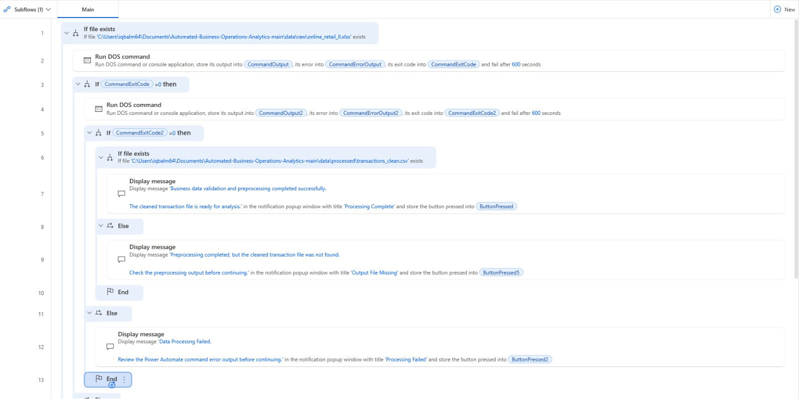
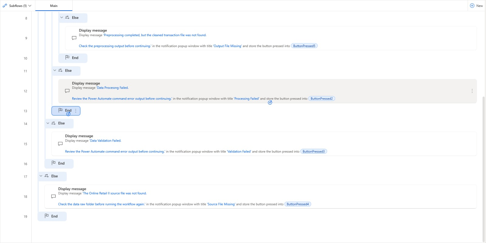

# Automated Business Operations & Performance Analytics

An end to end business analytics project that transforms over 1 million raw retail transactions into validated data, SQL analytics, automated reporting, operational exception monitoring and management insights.

## Business Problem

Recurring business reporting often requires analysts to manually validate files, clean transaction data, calculate KPIs, investigate exceptions and prepare reports for stakeholders.

I built this project to automate that workflow while maintaining a clear separation between data preparation, analytical logic and management reporting.

The solution processes 1,067,371 raw transactions and combines Python, MySQL, SQL, Excel, Power BI, Power Automate and AI to create a repeatable business reporting workflow.

## Technology Stack

**Data Processing:** Python, Pandas  
**Database:** MySQL  
**Analytics:** SQL, CTEs, joins, CASE expressions, window functions  
**Reporting:** Power BI, Excel  
**Automation:** Microsoft Power Automate Desktop  
**AI:** OpenAI API  
**Version Control:** Git, GitHub

## Dataset

The project uses the **UCI Online Retail II** dataset containing transactions from a UK based non store online retailer.

**Raw records:** 1,067,371  
**Cleaned records:** 1,033,036  
**Exact duplicates removed:** 34,335  
**Unique invoices:** 53,628  
**Unique customers:** 5,942  
**Countries:** 43  
**Period:** December 2009 to December 2011

The raw dataset is not stored in this repository because of its size.

Source: UCI Machine Learning Repository, Online Retail II.

## Data Validation and Preprocessing

I first profiled the complete dataset to understand missing values, duplicates, cancellations, stock adjustments and unusual pricing records.

The Python pipeline:

* validates required columns
* checks missing values and duplicates
* removes 34,335 exact duplicate rows
* standardises column names and data types
* distinguishes sales, cancellations and stock adjustments
* identifies zero price and accounting adjustment records
* preserves valid business exceptions instead of deleting them blindly
* exports 1,033,036 cleaned transaction records for SQL processing

This keeps data cleaning decisions transparent and reproducible.

## SQL Data Model

I built a MySQL star schema around the cleaned transaction data.

### Dimension Tables

* `dim_date`
* `dim_customer`
* `dim_product`
* `dim_location`

### Fact Table

* `fact_transactions`

The final fact table contains **1,033,036 transaction records** with validated relationships to the analytical dimensions.

Additional validation checks confirm:

* staging and fact row counts reconcile
* no missing dimension keys
* calculated transaction values reconcile
* unknown customers are handled consistently

## SQL Analytics

SQL acts as the main analytics engine rather than moving business logic into the reporting layer.

The analysis uses:

* CTEs
* joins
* CASE expressions
* subqueries
* `LAG`
* `ROW_NUMBER`
* `RANK`
* `DENSE_RANK`
* `NTILE`
* rolling averages
* month on month analysis
* year on year analysis

The reporting layer calculates:

* Revenue
* Orders
* Customers
* Average Order Value
* Monthly Growth
* Year on Year Growth
* Product Performance
* Country Performance
* Customer Segmentation
* Cancellation Trends
* Operational Exceptions

## Business Insights

The verified SQL reporting layer identified:

* **£20.48M** total sales revenue
* **40,077** sales orders
* **5,878** customers represented in the sales KPI layer
* **£510.92** average order value
* **£1.50M** revenue in November 2011
* **30.63%** month on month revenue growth in November 2011
* **13.74%** cancellation rate in November 2011

December 2011 is excluded from month on month management commentary because the source dataset ends on 9 December 2011.

The exception analysis also identifies cancellations, stock adjustments, zero price transactions and accounting adjustments for investigation rather than silently removing them from the source data.

## Power BI Dashboard

I built a **2 page Power BI dashboard** using dedicated SQL reporting views.

### Executive Performance

The first page focuses on overall business performance, including:

* Revenue
* Orders
* Customers
* Average Order Value
* Monthly performance
* Market performance

### Customers and Operational Exceptions

The second page focuses on:

* Customer segments
* Product performance
* Cancellation trends
* Operational exceptions

SQL performs the core calculations so Power BI remains focused on visual analysis and stakeholder reporting.

## Excel Management Reporting

I built an automated Excel reporting process that queries the SQL reporting layer and generates a management workbook containing seven reporting sheets:

1. Executive KPIs
2. Monthly Performance
3. Customer Segments
4. Product Performance
5. Country Performance
6. Cancellation Trends
7. Exceptions

The workbook automatically applies filters, freezes headers and adjusts column widths for practical business use.

## Power Automate Workflow

Microsoft Power Automate Desktop is used to automate the incoming data preparation workflow.

The tested workflow:

1. checks that the source transaction file exists
2. runs the Python data validation process
3. checks the validation exit code
4. runs the preprocessing pipeline
5. checks the preprocessing exit code
6. verifies that the cleaned transaction file was created
7. returns clear success or failure messages

This reduces repetitive manual execution while providing checks at each important stage of the workflow.

### Power Automate Workflow



### Successful Processing



The Power Automate action definition is also included in the `power_automate` directory.

## AI Management Commentary

The project includes an OpenAI API integration that converts verified SQL KPIs into concise management commentary.

The design follows one important principle:

> **SQL determines the truth. AI communicates it.**

The model receives only structured KPI results already calculated by SQL. It is instructed not to calculate or invent business figures.

The integration also handles API failures without interrupting the underlying analytics workflow.

Live AI generation requires a valid OpenAI API key and available API credits.

## Project Structure

```text
Automated-Business-Operations-Analytics/
│
├── python/
│   ├── 01_data_exploration.py
│   ├── 02_data_validation.py
│   ├── 03_data_preprocessing.py
│   ├── 04_export_powerbi_data.py
│   ├── 05_export_excel_report.py
│   ├── 06_management_summary.py
│   └── 07_ai_management_commentary.py
│
├── sql/
│   ├── 01_create_database.sql
│   ├── 02_create_staging_table.sql
│   ├── 03_load_staging_data.sql
│   ├── 04_data_quality_checks.sql
│   ├── 05_create_star_schema.sql
│   ├── 06_populate_star_schema.sql
│   ├── 07_star_schema_validation.sql
│   ├── 08_kpi_views.sql
│   ├── 09_business_analysis.sql
│   ├── 10_exception_analysis.sql
│   └── 11_powerbi_views.sql
│
├── excel/
│   └── business_performance_report.xlsx
│
├── power_automate/
│   └── business_operations_reporting_automation.txt
│
├── images/
│   ├── power_automate_workflow_1.jpeg
│   └── power_automate_workflow_2.jpeg
│
├── data/
├── requirements.txt
└── README.md
```

## Running the Project

Install the Python dependencies:

```bash
pip install -r requirements.txt
```

The Python scripts are numbered in execution order.

The SQL scripts are also numbered so the database can be created, populated, validated and analysed sequentially.

Database passwords are requested securely at runtime rather than stored in the repository.

For AI commentary, set the OpenAI API key as an environment variable:

```bash
export OPENAI_API_KEY="YOUR_API_KEY"
```

Never commit API keys or database credentials to the repository.

## Limitations

The source data covers December 2009 to December 2011 and therefore represents a historical retail dataset rather than current business performance.

December 2011 contains only partial month data and is excluded from latest complete month comparisons.

Some transactions do not contain customer identifiers, and the source also contains operational product codes, cancellations, stock adjustments and accounting records. These are retained or classified where appropriate rather than automatically treated as ordinary product sales.

## Key Learning

This project demonstrates how I approach analytics as more than dashboard creation. I built the workflow from raw data validation through dimensional modelling, SQL analysis, automation and stakeholder reporting.

The project demonstrates practical experience with **Python, SQL, MySQL, Excel, Power BI, Power Automate and AI integration** while keeping verified analytical logic separate from presentation and AI generated commentary.
